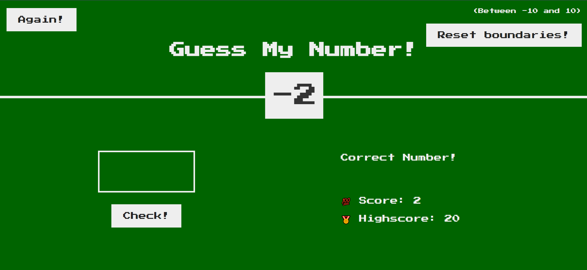
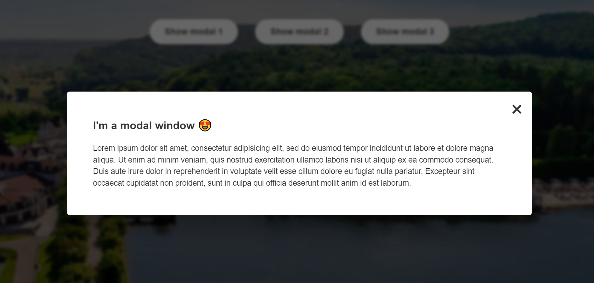
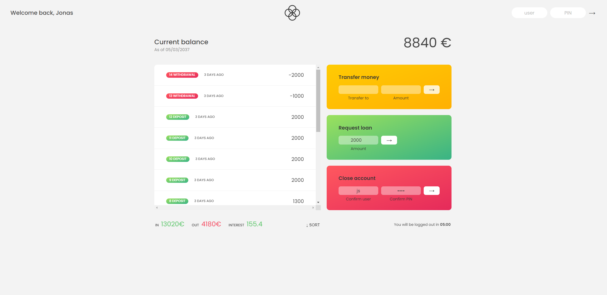
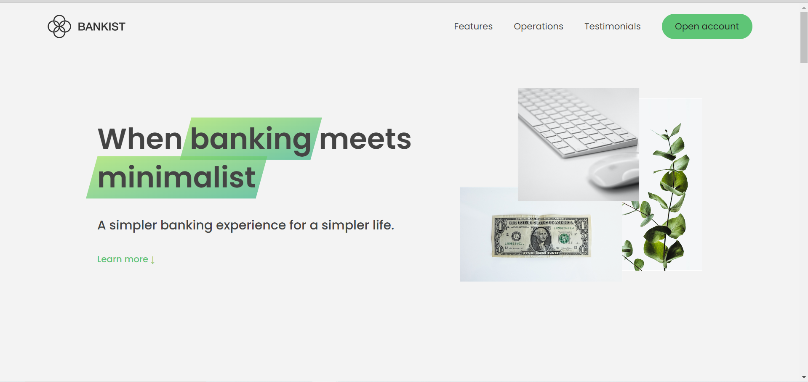
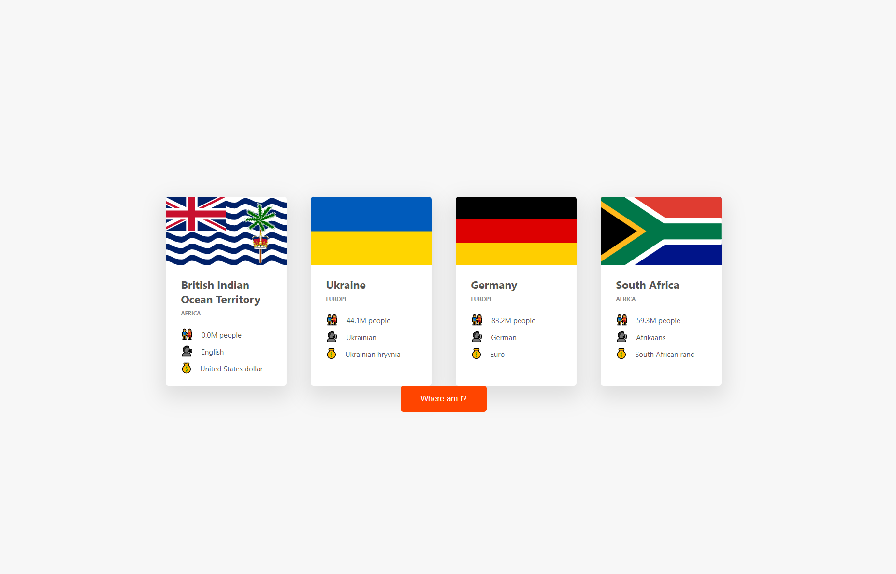

<ol>
<h1 align="center">❕Mini-programs were written for JS, HTML, CSS and DOM manipulation practice 🧑‍💻</h1>

<li><h2>Guess My Number ❓</h2>
<h4>Game where player can guess the number within boundaries entered at the beginning of the game.</h4></li>

<li><h2>Modal windows 🔲</h2>
<h4>It`s just a small program with 3 modal windows which are open/close through pure JS.</h4></li>

<li><h2>Pig game 🐷</h2>
<h5>Game where 2 players play a die. For win you must die till sum of all previous dice reach 50 points. If player die number 1, he/she lose.</h5></li>

<li><h2>Bank mini-app 💰</h2>
<h5>Bank mini-application for user`s manipulation with money, with next functionallity: logging with own credentials, transfer money to other users, loaning money, deleting account and sorting movements statistic.</h5></li>

<li><h2>Website for bank 💰</h2>
<h5>Bank mini-website for registration and reading information about bank`s possibilities(without some functionallity like Laze Loading, Revealing on scroll, Sticky navbar with using Intersection observer API) </h5></li>

<li><h2>Geocoding 📍</h2>
<h5>API which fetch geolocation data(country, city) from geocode.xyz by latitude and longtitude and fetch country data from restcountries.com with detail info about country.</h5></li>

</ol>
